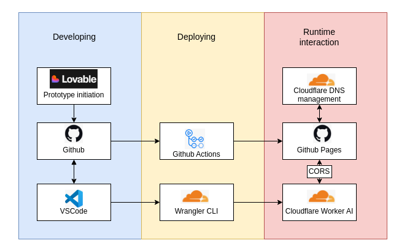

[[_TOC_]]

# Ayurvedic Recipe OCR (आयुर्वेद पाकशास्त्र)

A full-stack web application that digitizes handwritten Ayurvedic recipes using AI-powered OCR and vision capabilities. Upload an image of a handwritten recipe, and the application automatically extracts text, parses ingredients, and generates structured recipe data with Ayurvedic metadata (doshas, tastes, seasons, potency).

## Features

- **AI-Powered OCR**: Extracts text from handwritten Sanskrit and English recipe images using Cloudflare's AI vision models
- **Intelligent Data Parsing**: Automatically identifies ingredients, tastes, thermal properties, and seasonal appropriateness
- **Smart Deduction**: When recipe data is incomplete, the system intelligently infers missing information based on ingredient analysis and Ayurvedic principles
- **Recipe Visualization**: Displays extracted recipes with ingredient breakdowns and Ayurvedic metadata (doshas, tastes, seasons, potency)
- **Responsive UI**: Modern, accessible interface built with React and shadcn-ui

## Tech Stack

**High level overview:**



**Frontend:**
- React + TypeScript
- Vite (build tool)
- Tailwind CSS (styling)
- shadcn-ui (component library)
- React Router (routing)
- React Query (data management)

**Backend/AI:**
- Cloudflare Workers (AI processing)
- Cloudflare AI Models (vision & multimodal)

**Infrastructure:**
- GitHub Pages (hosting)
- GitHub Actions (CI/CD deployment)
- Cloudflare DNS & Pages (domain management)
- CORS configured for secure worker communication

## Getting Started

### Prerequisites
- Node.js 18+ (install with [nvm](https://github.com/nvm-sh/nvm#installing-and-updating))
- Bun (optional, for faster dependency management)

### Local Development

```sh
# Clone the repository
git clone https://github.com/mikehelder/claranueva-website.git
cd claranueva-website

# Install dependencies
npm install
# or with bun
bun install

# Start the development server
npm run dev
```

The app will be available at `http://localhost:5173`

### Building for Production

```sh
npm run build
npm run preview
```

## Project Structure

```
src/
├── components/        # React components (uploader, display, visualization)
├── pages/             # Page components
├── utils/             # Utilities (text extraction, mock data)
├── lib/               # Helpers (debug logging)
├── types/             # TypeScript definitions
└── hooks/             # Custom React hooks

ai-worker/             # Cloudflare Worker for AI processing
├── index.js           # Worker handler with AI vision prompt
└── wrangler.toml      # Worker configuration
```

## Deployment

### Frontend
The project is automatically deployed to GitHub Pages via GitHub Actions on every push to `main`:
- Hosted at: `https://www.claranueva.com` (with Cloudflare DNS)
- Deployment workflow: `.github/workflows/deploy.yml`

### Cloudflare Worker
Deploy the AI worker to Cloudflare:

```sh
cd ai-worker
wrangler deploy
```

Configure the `ALLOWED_ORIGIN` in `wrangler.toml` to match your deployment URL.

## How It Works

1. **Upload**: User uploads an image of a handwritten Ayurvedic recipe
2. **Extract**: Frontend sends image to Cloudflare Worker via CORS-enabled request
3. **Process**: Worker uses AI vision model to extract text and parse recipe structure
4. **Deduce**: If data is incomplete, the system infers missing fields using ingredient analysis
5. **Display**: Frontend renders the structured recipe with visual summaries

## Documentation

For detailed information about how the AI worker processes recipes, see **[AI_WORKER_GUIDE.md](docs/references/AI_WORKER_GUIDE.md)**. This document covers:
- What the worker does and how it processes images
- The AI prompt structure and deduction strategy
- Expected response format
- Configuration and deployment
- Error handling and troubleshooting

## Configuration

### Environment Variables
- Create a `.env.local` file or configure via deployment settings
- Worker CORS origin should match your frontend URL (configured in `ai-worker/wrangler.toml`)

## Contributing

This project was originally prototyped with Lovable and has been enhanced through local development in VS Code. Feel free to submit issues and pull requests!
